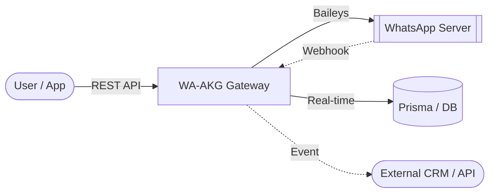

<div align="center">

# 🚀 WA-AKG: The Ultimate WhatsApp Gateway & Dashboard

[](https://wa.me/)
[](https://nextjs.org/)
[](https://www.typescriptlang.org/)
[](https://www.prisma.io/)
[](https://github.com/mrifqidaffaaditya/WA-AKG/releases)
[](https://github.com/mrifqidaffaaditya/WA-AKG)

[](https://api-wa-akg.aikeigroup.net/)

**A professional, multi-session WhatsApp Gateway, Dashboard, and Automation System.**  
Built with **Next.js 15**, **React**, and **Baileys** for high-performance messaging automation and real-time WhatsApp Bot Gateway services.

> [!TIP]
> **Looking for the latest features?** Check out the [beta branch](https://github.com/mrifqidaffaaditya/WA-AKG/tree/beta) or our [pre-releases](https://github.com/mrifqidaffaaditya/WA-AKG/releases) for experimental sources.

[Features](#-key-features) • [User Guide](docs/USER_GUIDE.md) • [API Documentation](docs/API_DOCUMENTATION.md) • [Database Setup](docs/DATABASE_SETUP.md) • [Installation](#-quick-installation)

</div>

---

## 📖 Complete Documentation

WA-AKG comes with extensive documentation designed for both developers and users.

- **[Master Project Documentation](docs/PROJECT_DOCUMENTATION.md)**: Architecture, database, and logic flow.
- **[API Documentation](docs/API_DOCUMENTATION.md)**: Comprehensive OpenAPI / Swagger guide for all **109+ endpoints**.
- **[API Quick Reference](docs/API-QUICK-REFERENCE.md)**: Instantly jumpstart your integration with ready-to-use cURL/JavaScript snippets.
- **[Environment Variables](docs/ENVIRONMENT_VARIABLES.md)**: Configuration and security guide.

---

## 🌟 Why WA-AKG WhatsApp API Gateway?

WA-AKG transforms your WhatsApp into a fully programmable RESTful API. It's designed for scale, reliability, and ease of use, making it the perfect bridge between your business logic and WhatsApp's global reach. Excellent for developing a **WhatsApp Bot**, Automation, or Customer Service Gateway.

### 🏗️ How it Works



### 🔥 Key Features

- **📱 Multi-Session Management**: Connect and manage unlimited WhatsApp accounts simultaneously via simple QR code scans.
- **⚡ Pro WhatsApp Engine**: Powered by `@whiskeysockets/baileys` for high-speed, stable, and secure WebSocket connections.
- **📅 Advanced Scheduler**: Precise message planning with **Media Support** (Images, Video, Docs).
- **📢 Safe Broadcast**: Built-in anti-ban mechanisms with randomized delays (10-30s) and batch processing.
- **🤖 Smart Auto-Reply**: Keywords matching with **Context Support** (Group/Private/All) and **Media Attachments**.
- **🛡️ Granular Access Control**: Full **Whitelist** & **Blacklist** support for both Bot Commands and Auto Replies.
- **🔗 Enterprise Webhooks**: Robust real-time event forwarding for messages, connections, status changes, and group updates.
- **📇 Advanced Contacts**: Rich contact management with LID, verified names, and profile pictures.
- **🎨 Creative Tools**: Built-in Sticker Maker with background removal (`remove.bg` integration).
- **📘 Open API Spec**: Fully documented via `swagger-ui-react` at `/docs`.

<details>
<summary>📂 <b>View Webhook Payload Example</b></summary>

```json
{
  "event": "message.received",
  "sessionId": "xgj7d9",
  "timestamp": "2026-01-17T05:33:08.545Z",
  "data": {
    "key": { "remoteJid": "6287748687946@s.whatsapp.net", "fromMe": false, "id": "3EB0B78..." },
    "from": "6287748687946@s.whatsapp.net",
    "sender": "100429287395370@lid",
    "remoteJidAlt": "100429287395370@lid",
    "type": "TEXT",
    "content": "saya sedang reply",
    "isGroup": false,
    "quoted": {
      "type": "IMAGE",
      "caption": "Ini caption dari reply",
      "fileUrl": "/media/xgj7d9-A54FD0B6F..."
    }
  }
}
```
</details>

---

## 🧩 Integrations: Native n8n Support

WA-AKG natively supports **n8n**! You can build complex, no-code/low-code WhatsApp automation workflows using our official community nodes.

[](https://www.npmjs.com/package/n8n-nodes-wa-akg)

- **Action Node**: Full control over messaging, groups, sessions, contacts, and labels directly from your n8n workflows.
- **Trigger Node**: Instantly catch real-time webhooks (Message Received, Group Joined, etc.) and trigger your workflows automatically.

👉 **[View on npm (n8n-nodes-wa-akg)](https://www.npmjs.com/package/n8n-nodes-wa-akg)**

---

## 🚀 Quick Installation

### 1. Prerequisites
- Node.js 20+ (Node.js 22 recommended)
- MySQL or PostgreSQL
- Git
- PM2 (Installed globally: `npm install -g pm2`)

### 2. Setup
```bash
# Clone and install
git clone https://github.com/mrifqidaffaaditya/WA-AKG.git
cd WA-AKG
npm install

# Configure environment
cp .env.example .env
# Edit .env with your DATABASE_URL, AUTH_SECRET, PORT, etc.

# Push schema and generate Prisma Client
npm run db:push

# Create SuperAdmin account
npm run make-admin admin@example.com password123
```

### 3. Run (Development)
```bash
npm run dev
```

### 4. Run (Production with PM2 - Recommended)
We recommend deploying with **PM2** to run the app in the background and ensure it restarts automatically if the server rebooted or crashed.

#### Option A: Automatic Setup Script (Easiest)
We provide a built-in [start.sh](file:///home/aditya/project/WA-AKG/start.sh) script that automates everything: checking the configuration, installing dependencies, syncing the database schema, compiling production assets, and starting or reloading PM2:
```bash
./start.sh
```

#### Option B: Manual Setup
1. **Build the application**:
   ```bash
   npm run build
   ```

2. **Start with PM2**:
   Using the built-in [ecosystem.config.js](file:///home/aditya/project/WA-AKG/ecosystem.config.js) configuration file:
   ```bash
   pm2 start ecosystem.config.js
   ```

3. **Manage the process**:
   - View status: `pm2 status`
   - View logs: `pm2 logs wa-akg`
   - Stop process: `pm2 stop wa-akg`
   - Restart process: `pm2 restart wa-akg`

4. **Enable auto-start on server boot**:
   ```bash
   pm2 startup
   # Copy-paste the command outputted by the command above
   pm2 save
   ```

---

### 🐋 Alternative: Docker Deployment
Although **PM2 is highly recommended**, you can also deploy using Docker Compose:

1. **Prepare Environment**:
   ```bash
   cp .env.example .env
   ```
   Edit `.env` — set `DATABASE_URL` (points to the MySQL container), `AUTH_SECRET`, and other branding settings.

2. **Start Services**:
   ```bash
   docker compose up -d
   ```
   This spins up the MySQL database container alongside the Next.js gateway application.

---

## 📚 API Reference Overview

WA-AKG provides a comprehensive REST API to integrate WhatsApp Messaging directly into your applications. Full details in [API_DOCUMENTATION.md](docs/API_DOCUMENTATION.md).

> [!TIP]
> Use the built-in **Swagger UI** for interactive exploration at `/docs`.

| Method | Endpoint | Description |
| :--- | :--- | :--- |
| `POST` | `/api/messages/{sessionId}/{jid}/send` | Send text, media, or stickers |
| `POST` | `/api/messages/{sessionId}/broadcast` | Scalable bulk messaging |
| `PATCH` | `/api/sessions/{id}/settings` | Update session configuration |
| `GET` | `/api/groups/{sessionId}` | List all available groups |
| `POST` | `/api/webhooks/{sessionId}` | Register real-time event listeners |
| `POST` | `/api/autoreplies/{sessionId}` | Create context-aware auto-replies |
| `POST` | `/api/auth/register` | Register new users via the web securely |

### Example: Send Text Message
```bash
curl -X POST http://localhost:3000/api/messages/session_01/62812345678@s.whatsapp.net/send \
  -H "X-API-Key: your_api_key" \
  -H "Content-Type: application/json" \
  -d '{
    "message": { "text": "Hello from WA-AKG!" }
  }'
```

---

## ⚠️ Known Issues / Caveats

> [!WARNING]
> **Status Update Feature (POST `/api/status/update`)**
> 
> The WhatsApp status/story update feature is currently **experiencing known issues** and should be avoided in production:
> - Text statuses with custom background colors may not display correctly
> - Media statuses (images/videos) may fail to upload to WhatsApp servers
> - The feature is under active development
> 
> We recommend waiting for the next release before using this endpoint in critical workflows.

---

## 🛡️ Security
- **API Key Auth**: Secured endpoints using `X-API-Key` header.
- **RBAC**: Multi-role support (`SUPERADMIN`, `OWNER`, `STAFF`).
- **Encrypted Passwords**: All passwords hashed with bcrypt.
- **JWT Encryption**: Session tokens signed with `AUTH_SECRET` (wajib diisi — tidak ada fallback).
- **Input Validation**: Zod schemas on critical endpoints.
- **Media Protection**: Path traversal prevention, session-scoped media access.

---

<div align="center">
  Built with ❤️ by <a href="https://github.com/mrifqidaffaaditya">Aditya</a>  
  Licensed under <a href="LICENSE">MIT</a>
</div>
